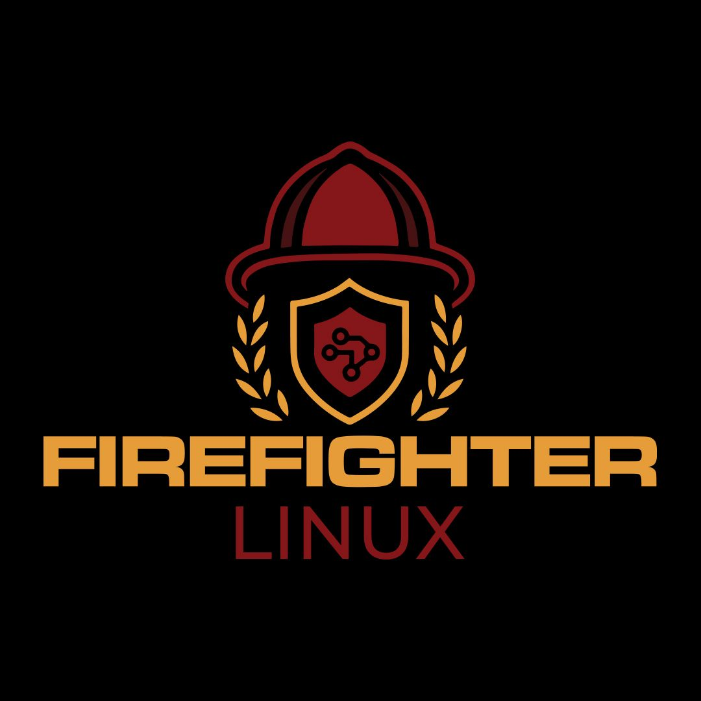

# Firefighter-Linux: The Ultimate Cyber Defense Doctrine

**Firefighter-Linux** is an open-source, intelligence-driven, and proactive cybersecurity operations doctrine designed to transcend reactive defense. Built entirely on powerful open-source tools, its name is inspired by a new generation of "firefighters" who don't just extinguish digital fires—they prevent them and proactively hunt the arsonists.

Our doctrine is simple, yet absolute: **Zero Trust. Zero Tolerance. Continuous Hunt.**

---

## The Vision

To build a fully integrated, self-hosted, and enterprise-grade security platform that can be deployed as a standardized Linux distribution (ISO). This project provides not just the tools, but a complete operational roadmap for achieving cybersecurity dominance.

This public repository contains the doctrine, methodology, roadmap, and all public-facing documentation. The actual infrastructure-as-code is maintained in a separate, private repository.

## The Doctrine

* **Zero Trust:** No entity, internal or external, is trusted by default. Everything is verified, authenticated, and audited.
* **Zero Tolerance:** No anomaly or policy violation is ignored. Every event is either handled through automation or requires analyst intervention.
* **Continuous Hunt:** We operate under the assumption of a breach. We don't wait for alarms; we continuously hunt for adversaries within our systems.

## Project Roadmap

The project is structured into three evolutionary versions:

### **V1: Building the Foundation - The Installation Manifesto**
*Goal: To establish the most comprehensive open-source cyber operations infrastructure with full, albeit manual, operational capability.*

* **Phase 0: The Core Infrastructure:** Observability stack (Prometheus, Grafana, Loki) and secret management (Vault).
* **Phase 1: The Central Brain:** Data Lake (OpenSearch) and CTI Platforms (MISP, OpenCTI).
* **Phase 2: Perception & Observation:** Endpoint sensors (Wazuh, Falco), and the Network Visibility Triad (Suricata, Zeek, Arkime).
* **Phase 3: Active Intelligence & Hunting:** IOC Enrichment (IntelOwl), Deception Network (T-Pot), and Malware Analysis (CAPE Sandbox).
* **Phase 4: Command & Control:** Incident Management (TheHive, Cortex) and Retro-Hunting (osquery).
* **Phase 5: Doctrine & Knowledge:** Knowledge Base (BookStack/MkDocs) and Strategic Reporting (MITRE ATT&CK Navigator).

### **V2: Automating Firefighter-Linux - The Autonomous Defense Doctrine**
*Goal: To achieve light-speed, consistent, and scalable autonomous response to all known threats, freeing human intelligence for creative and complex tasks.*

* **Projects:** Full SOAR orchestration (Shuffle), Infrastructure as Code at scale (Ansible, Terraform, Kubernetes), Detection-as-Code (CI/CD for rules), and Automated Threat Hunting.

### **V3: Evolving Firefighter-Linux - Predictive Security & AI Dominance**
*Goal: To predict the unknown. To transition defense from a reactive to a predictive state by anticipating the adversary's next move.*

* **R&D Projects:** User and Entity Behavior Analytics (UEBA), Predictive Threat Modeling with AI on graph databases, NLP for automated intelligence gathering, and an AI-assisted decision support system for analysts.

---

## Contributing

This is an open-source effort. We welcome contributions to the doctrine, documentation, and overall philosophy. Please refer to `CONTRIBUTING.md` (to be created) for more details.

## License

This project is licensed under the MIT License.
